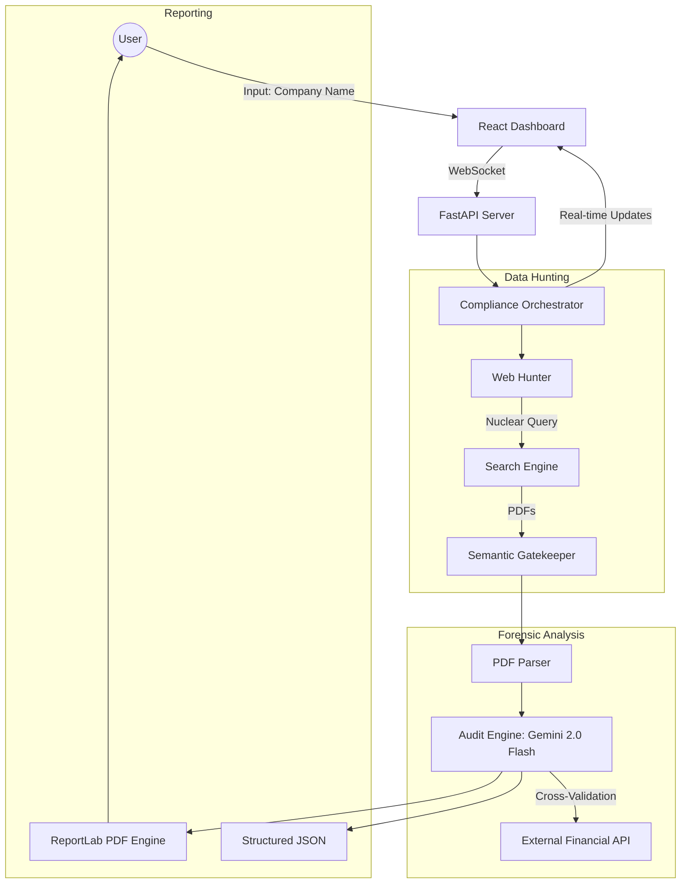

# 🤖 AutoLabor Compliance Agent

**AutoLabor Compliance Agent** is an enterprise-grade AI auditor designed to automate labor compliance monitoring for large conglomerates. It leverages Gemini 2.0 Flash's 1M+ context window to perform forensic audits of Annual Reports, BRSR (Business Responsibility and Sustainability Reports), and financial statements in real-time.

---

## 🏗️ System Architecture

The system is built on a modular "Orchestration" protocol that bridges deep web search, forensic document analysis, and real-time visualization.



---

## 🛠️ Core Technology Stack

### Backend (The "SANE-AI" Core)
- **FastAPI:** High-performance async API framework.
- **Gemini 2.0 Flash:** Used for "Monolithic Protocol" analysis, allowing the system to ingest thousands of pages of text in a single pass for cross-document validation.
- **WebHunter & Nuclear Search:** Customized scraping logic that optimizes search queries to bypass "subsidiary drift" (e.g., distinguishing between Mahindra & Mahindra parent vs. Mahindra Finance).
- **ReportLab:** A low-level PDF generation engine used to build professional, corporate-ready compliance reports with dynamic tables and risk badges.
- **WebSocket Protocol:** Ensures sub-second feedback loops between the AI pipeline and the user interface.

### Frontend (The Dashboard)
- **React + Vite:** Modern, fast, and responsive UI foundations.
- **Glassmorphism Design:** A premium, state-of-the-art interface utilizing HSL-tailored colors and smooth backdrop blurs.
- **Context API:** Manages global state for real-time audit progress and multi-company comparisons.
- **Framer Motion:** Implements subtle micro-animations for an interactive user experience.

---

## 🔍 Key Project Components

### 1. The Semantic Gatekeeper
A critical component in the `ComplianceOrchestrator` that uses "Nuclear Disambiguation" to ensure that the documents gathered belong *strictly* to the parent OEM. It filters out joint ventures, finance subsidiaries, and other "poison entities" that often contaminate corporate compliance datasets.

### 2. Forensic Cross-Validation
Unlike standard RAG systems, AutoLabor patches missing data in PDF reports with real-time external financial APIs (e.g., fetching actual EBITDA or Revenue if not clearly stated in the text).

### 3. Sector Analysis Engine
Aggregates compliance data across companies to provide an "Overall Risk Score" (Low, Moderate, High) and strategic recommendations for supply chain liability management.

---

## 📦 Detailed Setup & Deployment

### 1. Prerequisites
- **Python 3.10+**
- **Node.js 18+**
- **Google Cloud API Key** (for Gemini AI)

### 2. Backend Installation
```bash
cd auto-labor-compliance-agent
python -m venv venv
source venv/bin/activate  # or venv\Scripts\activate on Windows
pip install -r requirements.txt
python main.py
```

### 3. Frontend Installation
```bash
cd frontend
npm install
npm run dev
```

### 4. Docker Deployment
The project includes a multi-stage `docker-compose.yml` that handles both the React frontend and FastAPI backend in isolated containers.
```bash
docker-compose up --build
```

---

## 📑 API Documentation

- **`WS /ws/audit`**: Primary real-time endpoint for triggering new audits.
- **`GET /api/reports`**: List all consolidated compliance reports.
- **`GET /api/download_report?company={name}`**: Download the professional PDF audit.
- **`POST /api/compare`**: Submit multiple company names for a side-by-side gap analysis.

---

## 🛡️ License & Contact
Developed as part of the **AutoLabor Compliance** initiative. 
For support or collaboration, please visit the [GitHub Repository](https://github.com/sanskrutipasalkar10/auto-labor-compliance-agent).


